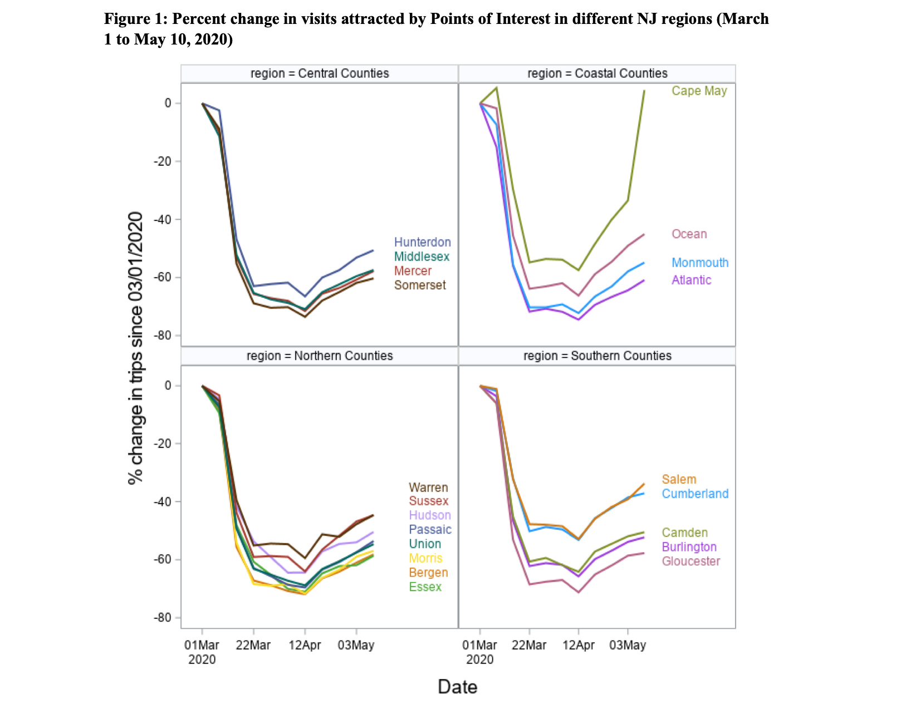
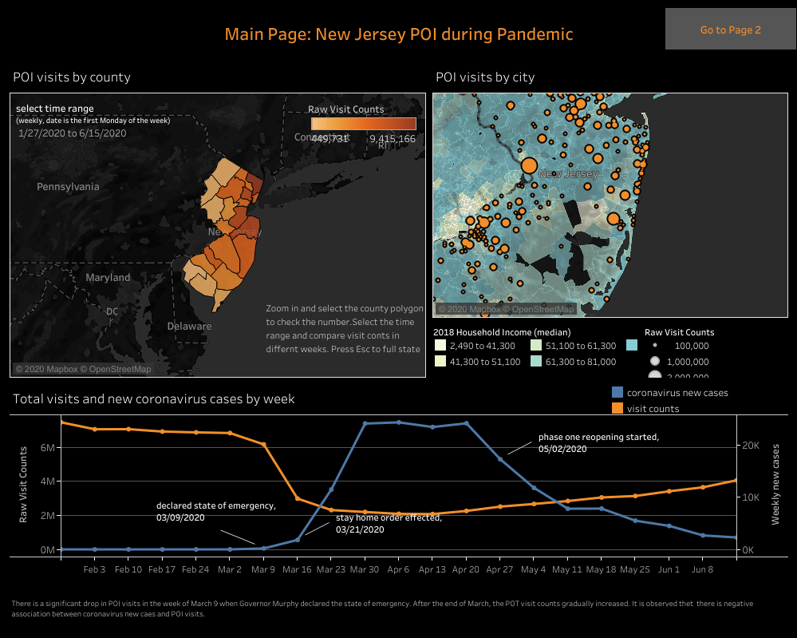
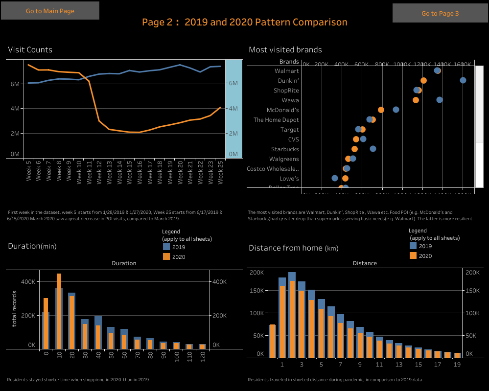
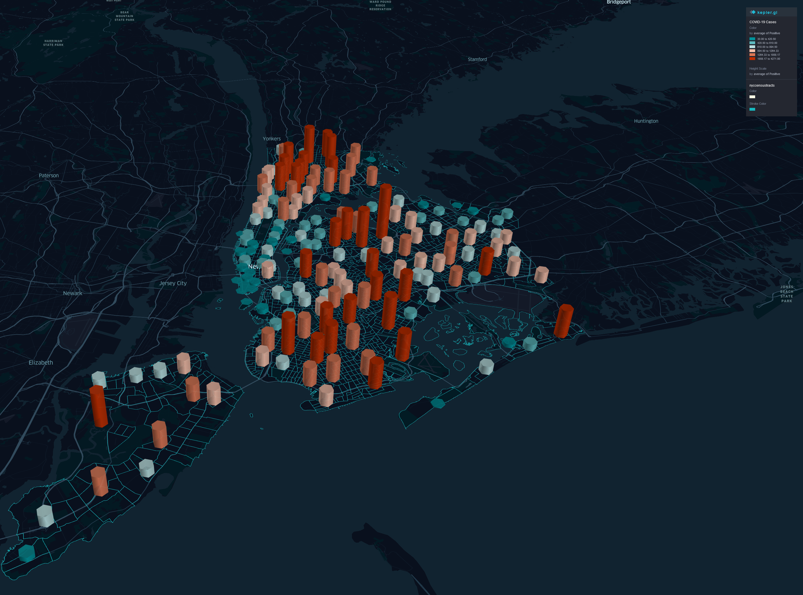

```{r setup, include=FALSE}
knitr::opts_chunk$set(echo = FALSE)
```

# About the lab

## Our Team
{width=80%}

## Goals of the lab
- To implement new & emerging technologies to support data-driven decisionmaking
- To collaborate with policymakers, academic insitutions and stakeholders to develop smart, socially just and healthy cities
- To serve as a resource for Bloustein masters programs

# Our Research

## COVID-19 Movement and Mobility Patterns in NJ

- Anonymized cell phone location data used to track visits to public spaces in NJ towns and counties

- [Report by Dean Thakuriah](https://rucilab.rutgers.edu/2020/07/13/covid-19-and-movement-patterns-in-new-jersey/) covered movement patterns during height of lockdown

--- 

{width=80%}

## Key findings
- During March shutdown, visits fell 80% compared to beginning of the month
- Northern and central counties had greatest decline
- People spent more time and travelled farther to stores, stocking up at the start of the pandemic
- Differences in food shopping apparent in areas with greater poverty
- Future report will examine how NJ reopened from May to present.

## NJ POI visit Dashboard
- [Dashboard](https://public.tableau.com/profile/haoyun6665#!/vizhome/POIdashboard/Mainpage) created by Bloustein MPI / MCRP dual degree student Haoyun Wang as part of internship with RUCI
- Tracks visits by ZIP code with comparisons to 2019 levels
- Identified top brands for visits during the pandemic

---

{width=80%}

---

{width=80%}

## COVID-19 in New York City
{width=80%}

## The Environmental Determinants of COVID-19

- Linking COVID-19 data with census, social media and transit data
- ***11.5 million*** rows of data collected
- Data Use Agreement signed with NYC to obtain more granular case / death data
- Machine learning and modeling will be used to uncover trends in environmental factors impacting the spread of COVID.

## Opportunities to get involved
- We currently work with MPI, MCRP and MPP students
- R, Python and Linux experience is highly desirable
- Future opportunities to get involved will be announced soon

# Q & A
Questions?

## Learn More About RUCI
Contact us: rucilab@ejb.rutgers.edu

[rucilab.rutgers.edu](https://rucilab.rutgers.edu)


