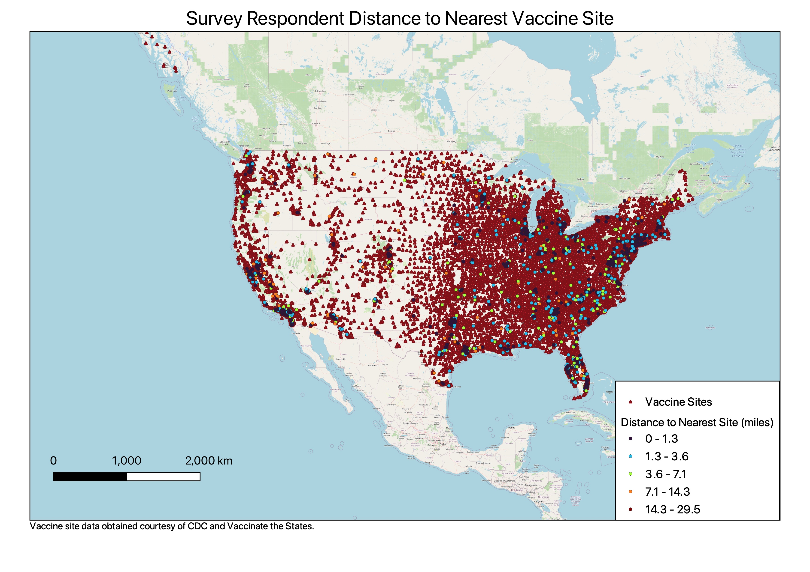
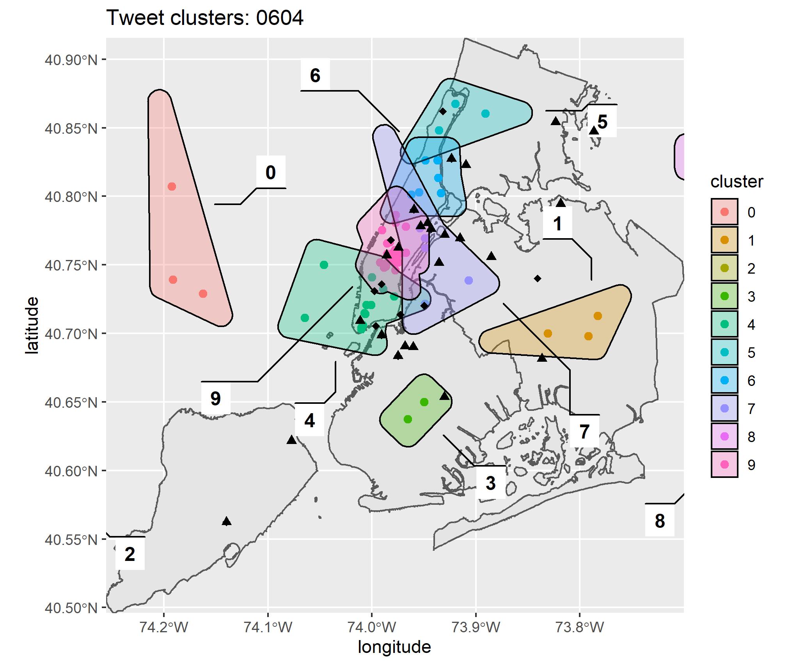
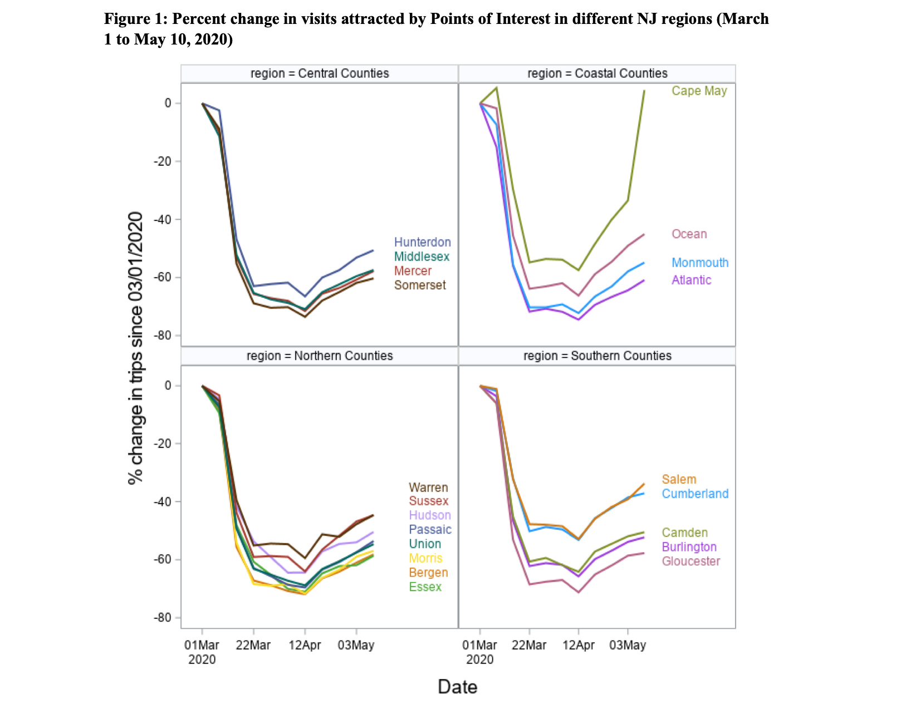

```{r setup, include=FALSE}
knitr::opts_chunk$set(echo = FALSE)
```

# About the lab

## Our Team
{width=80%}

## Goals of the lab
- To implement new & emerging technologies to support data-driven decisionmaking
- To collaborate with policymakers, academic insitutions and stakeholders to develop smart, socially just and healthy cities
- To serve as a resource for Bloustein masters programs

# Our Research

## COVID-19 Vaccine Hesistancy

- How do public transportation barriers impact it?
- Survey dataset was joined with scraped vaccine site data to create model.
- Respondents were matched to the nearest vaccine site using GIS.
- In general, the vaccinated were likely to travel further than the vaccinated.


## 

{width=90%}

## Estimating Protest Crowd Size With Tweets

{width=70%}

- Project integrates Twitter data with official and crowd-sourced data on NYC racial justice protests
- Clusters correspond to locations with protests taking place.


## COVID-19 Movement and Mobility Patterns in NJ

- Anonymized cell phone location data used to track visits to public spaces in NJ towns and counties

- [Report by Dean Thakuriah](https://rucilab.rutgers.edu/2020/07/13/covid-19-and-movement-patterns-in-new-jersey/) covered movement patterns during height of lockdown

--- 

{width=80%}

## Key findings
- During March shutdown, visits fell 80% compared to beginning of the month
- Northern and central counties had greatest decline
- People spent more time and travelled farther to stores, stocking up at the start of the pandemic
- Differences in food shopping apparent in areas with greater poverty
- Future report will examine how NJ reopened from May to present.

## Opportunities to get involved
- We currently work with MPI, MCRP and MPP students
- GIS, R, or Python experience is highly desirable

# Q & A
Questions?

## Learn More About RUCI
Contact the lab: rucilab@ejb.rutgers.edu
Contact me: gavin.rozzi@rutgers.edu

[rucilab.rutgers.edu](https://rucilab.rutgers.edu)

## Thank you!

